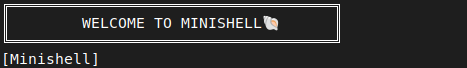
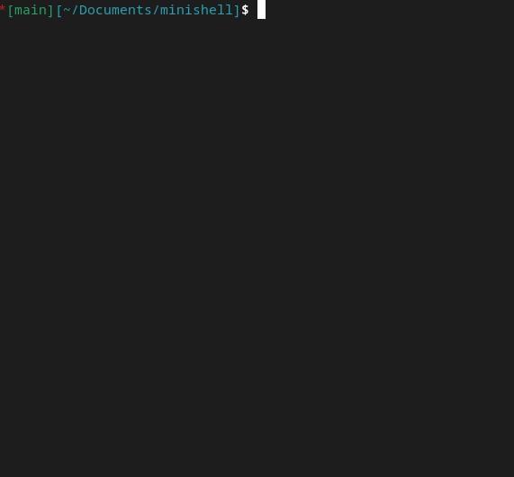

# Minishell


## Table of Contents

- [Introduction](#introduction)
- [Features](#features)
- [Installation](#installation)
- [Usage](#usage)
- [Built-in Commands](#built-in-commands)
- [Contributors](#contributors)

## Introduction

Minishell is a simple Unix shell implementation , featuring basic command execution, built-in commands, redirections, pipes, and environment variable handling. 
This project aims to deepen the understanding of system programming and process management.

## Features
- Display a prompt and wait for the user to type a command.
- Implement a series of built-in commands.
- History
- Handle command execution using `execve`.
- Manage errors effectively and provide relevant messages.
- Handle $? which expand to the exit status of the most recently executed foreground pipeline.
- Handle signals like `Ctrl+C`, `Ctrl+D` and `Ctrl+\`.
- Implement basic (`<`, `>`, `>>`, `<<`).
- Implement pipes (`|`).

## Installation
To install and set up `minishell`, follow these steps:

1. Clone the repository:
    ```sh
    git clone git@github.com:Bussiereg/minishell.git
    ```
2. Navigate in the folder:
    ```sh
    cd Minishell
    ```

3. Build the project:
    ```sh
    make
    ```

## Usage
To start `minishell`, run the following command after building the project:
```sh
./minishell
```
**Here a small demonstration:**



## Built-in Commands

Minishell supports the following built-in commands:

- echo [args]: Displays the given arguments.
- cd [dir]: Changes the current directory to dir.
- pwd: Prints the current working directory.
 -export [name[=value]]: Sets an environment variable.
- unset [name]: Unsets an environment variable.
- env: Displays the environment variables.
- exit: Exits the shell.

# Contributors
- [Guillaume Bussiere](https://github.com/Bussiereg)
- [Jules Bernard](https://github.com/julesrb)
